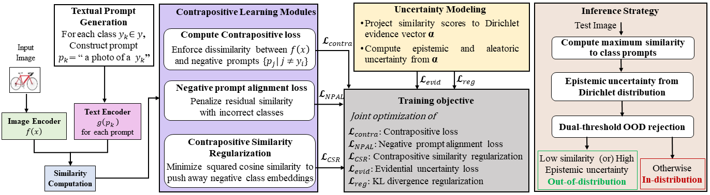

 
#  Learning by Exclusion: Evidential Contrapositive Learning for Zero-Shot Out-of-Distribution Detection

This is the offical repository for our [ECL]


### Illustration



## Data Preparation

We consider the following (in-distribution) datasets: CIFAR-10, CIFAR-100

**Small-scale OOD datasets** For small-scale ID (e.g. CIFAR-100), we use SVHN, Textures (dtd), Places365, LSUN and iSUN. 

OOD datasets can be downloaded via the following links (source: [ATOM](https://github.com/jfc43/informative-outlier-mining/blob/master/README.md) and [CIDER](https://github.com/deeplearning-wisc/cider?tab=readme-ov-file#how-to-exploit-hyperspherical-embeddings-for-out-of-distribution-detection)):

* [SVHN]: Download and place it in the folder of `datasets/small_OOD_dataset/svhn`. Then run `python utils/select_svhn_data.py` to generate test subset.
* [Textures](https://www.robots.ox.ac.uk/~vgg/data/dtd/download/dtd-r1.0.1.tar.gz): download it and place it in the folder of `datasets/small_OOD_dataset/dtd`.
* [Places365](http://data.csail.mit.edu/places/places365/test_256.tar): download it and place it in the folder of `datasets/ood_datasets/places365/test_subset`. We randomly sample 10,000 images from the original test dataset. 
* [LSUN-C](https://www.dropbox.com/s/fhtsw1m3qxlwj6h/LSUN.tar.gz): download it and place it in the folder of `datasets/small_OOD_dataset/LSUN`.
* [iSUN](https://www.dropbox.com/s/ssz7qxfqae0cca5/iSUN.tar.gz): download it and place it in the folder of `datasets/small_OOD_dataset/iSUN`.


## Evaluation
 
1. extract features
    ```bash
    python eval/extract_features.py  # specify model name ['ViT-B/16', 'ViT-B/32','ViT-L/14', 'RN50', 'RN101']  
    ```
2. evaluation
    ```bash
    python eval/eval_ood_cifar_100.py --model_name  ['ViT-B/16', 'ViT-B/32','ViT-L/14', 'RN50', 'RN101'] --shuffle --M [int_number_of_augmentations] --temp [temperature] --score_name ['MSP', 'Max-Logit','Energy','GEN']
    python eval/eval_ood_imagenet_100.py --model_name  ['ViT-B/16', 'ViT-B/32','ViT-L/14', 'RN50', 'RN101'] --shuffle --M [int_number_of_augmentations] --temp [temperature] --score_name ['MSP', 'Max-Logit','Energy','GEN'] 
    python eval/eval_ood_imagenet_1k.py --model_name  ['ViT-B/16', 'ViT-B/32','ViT-L/14', 'RN50', 'RN101'] --shuffle --M [int_number_of_augmentations] --temp [temperature] --score_name ['MSP', 'Max-Logit','Energy','GEN']  
    ```
3. texture embedding analysis
   ```bash
    python eval/SVD_text_embeddings.py
    ```


## Acknowledgement

Our data preparartion code is adapted from [ViM](https://github.com/haoqiwang/vim) and [CIDER](https://github.com/deeplearning-wisc/cider?tab=readme-ov-file#how-to-exploit-hyperspherical-embeddings-for-out-of-distribution-detection) repos, thanks a lot for their great work!
